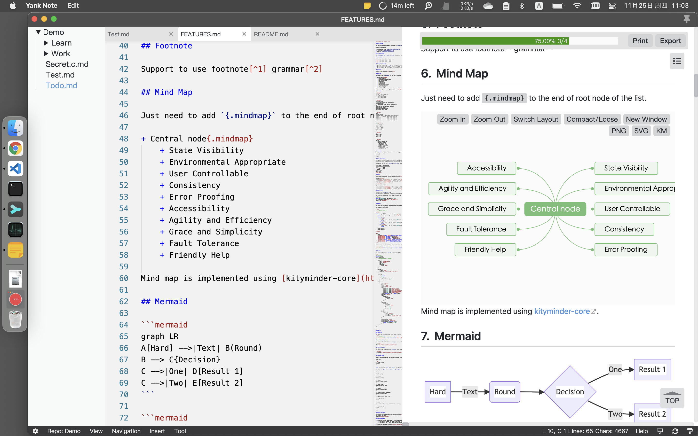

# Yank Note
> Yank Note 是一款**针对程序员**的 Markdown 编辑器，目标应用场景为在本机写文章、日志、笔记。

> App Store 版本由于沙盒的限制，没有“浏览器中打开”、“终端”功能。如需要使用这两个功能，请访问 https://github.com/purocean/yn 下载完整功能版本。

+ **使用方便**：使用 Monaco 编辑器（VSCode 编辑器内核）编辑，针对 Markdown 文件添加了快捷键和补全规则
+ **兼容性强**：资源保存本地，Markdown 文件可简单处理离线工作；拓展功能尽量用 Markdown 原有的语法实现
+ **高拓展性**：可在文档中嵌入小工具、可运行的代码块、表格、Plantuml 图形、Drawio 图形等、可自定义插件拓展编辑器功能
+ **支持加密**：用来保存账号等隐私文件，文件可单独设置密码

## 使用技巧

+ 加密文件的加密解密操作均在前端完成，请**务必牢记自己的密码**。一旦密码丢失，就只能暴力破解了。

## 特色功能

部分功能需要相关快捷键配合，可参考*特色功能说明*

- 同步滚动：编辑区和预览区同步滚动，预览区可独立滚动
- 目录大纲：预览区目录大纲快速跳转
- 文件加密：以 `.c.md` 结尾的文件视为加密文件
- 自动保存：文件编辑后自动保存，未保存文件橙色标题栏提醒（加密文档不自动保存）
- 编辑优化：列表自动补全
- 粘贴图片：可快速粘贴剪切板里面的图片，可作为文件或 Base64 形式插入
- 嵌入附件：可以添加附件到文档，点击在系统中打开
- 代码运行：支持运行 JavaScript 代码
- 待办列表：支持显示文档中的待办进度，点击可快速切换待办状态
- 快速打开：可使用快捷键打开文件切换面板，以便快捷打开文件，标记的文件，全文搜索文件内容
- 公式解析：支持输入 katex 公式代码
- 样式风格：Markdown 使用 GitHub 风格样式和特性
- 数据仓库：可定义多个数据位置以便文档分类
- 外链转换：将外链或 BASE64 图片转换为本地图片
- HTML 解析：可以直接在文档里面使用 HTML 代码，也可以使用快捷键粘贴复制 HTML 为 Markdown
- docx 导出：后端使用 pandoc 做转换器
- TOC 支持：生成 TOC 在需要生成目录的地方写入 `[toc]{type: "ol", level: [1,2,3]}` 即可
- 编辑表格单元格：双击表格单元格即可快速编辑
- 复制标题链接：复制标题链接路径到剪切板，便于插入到其他文件
- 嵌入小工具：文档支持内嵌 HTML 小工具
- 嵌入 Plantuml 图形：需要安装 Java，graphviz
- 嵌入 drawio 图形：文档支持内嵌 drawio 图形
- 嵌入 ECharts 图形：在文档中嵌入 Echarts 图形
- 嵌入 Mermaid 图形：在文档中嵌入 Mermaid 图形
- 嵌入 Luckysheet 表格：在文档中嵌入 Luckysheet 表格
- 嵌套列表转脑图展示：可将嵌套列表用脑图的方式展示
- 元素属性书写：可自定义元素的任意属性
- 表格解析增强：表格支持表格标题多行文本，列表等特性
- 文档交叉链接跳转：支持在文档中引入其他文档，互相跳转
- 脚注功能：支持在文档中书写脚注
- 容器块：支持类似 VuePress 默认主题的自定义容器
- 图床：支持 [PicGo](https://picgo.github.io/PicGo-Doc/) 图床
- 自定义插件：支持编写 JavaScript 插件拓展编辑器功能。插件放置在 `主目录/plugins` 中，文档待完善
